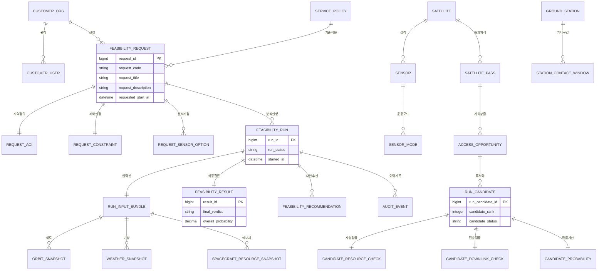

# feasibility 판정 시스템 ERD 설계 보고서

기준일: 2026-03-07

## 목적

이 문서는 [촬영가능성 계산 절차 조사](/Users/jaehojoo/Desktop/codex-lgcns/sattie/guide/촬영가능성%20계산%20절차%20조사.md)를 근거로, `요청자 인풋`과 `외부 인풋`을 받아 위성영상 촬영 feasibility를 판정하는 시스템을 구축할 때 필요한 데이터 모델과 ERD를 설계한 보고서다.

핵심 요구는 다음과 같다.

- 고객이 넣은 요구조건이 무엇이었는지 추적 가능해야 한다.
- 어떤 외부 데이터 버전으로 계산했는지 재현 가능해야 한다.
- feasibility가 왜 `feasible`, `conditionally feasible`, `infeasible`로 나왔는지 감사 가능해야 한다.
- 후보 촬영기회, 지상국 패스, 자원 병목, 확률 계산을 엔터티 단위로 저장해야 한다.

즉, 이 시스템의 ERD는 단순 주문 DB가 아니라 `판정 재현성`, `시계열 외부데이터`, `계산 run 이력`, `설명 가능한 결과`를 중심으로 설계되어야 한다.

## 설계 원칙

### 1. 요청 데이터와 외부 데이터와 계산 결과를 분리한다

feasibility는 다음 세 부류의 데이터가 섞이면 관리가 무너진다.

- `요청자 인풋`: AOI, 시간창, 구름량, off-nadir, 제품 레벨, 우선순위
- `외부 인풋`: 궤도력, 센서 성능, 기상예보, 태양고도, 지상국 패스, 메모리/전력 스냅샷, 기존 예약 임무
- `계산 결과`: 후보 pass, 충돌 판정, 성공확률, 제안 옵션, 최종 verdict

따라서 ERD는 이 세 축을 테이블 계층으로 명확히 끊어야 한다.

### 2. 요청 원본은 불변으로 저장한다

고객 입력은 나중에 바뀌면 안 된다. 수정이 필요하면 기존 요청을 덮어쓰지 않고 `새 버전` 또는 `새 feasibility request`를 만들어야 한다.

### 3. 외부 인풋은 `snapshot/version`으로 저장한다

동일한 요청도 `2026-03-07 09:00 기상예보`와 `2026-03-07 15:00 기상예보`를 쓰면 결과가 달라질 수 있다. 따라서 외부 인풋은 항상 `언제 수집한 어떤 버전인지`가 남아야 한다.

### 4. 계산 결과는 `run` 단위로 저장한다

같은 요청을 여러 번 다시 계산할 수 있으므로, 최종 verdict만 저장하면 안 된다. `feasibility_run`과 그 하위 결과를 따로 가져가야 한다.

## 시스템이 받아야 하는 입력의 구조

## 1. 요청자 인풋

요청자 인풋은 대략 다음 묶음으로 나뉜다.

- 요청자 식별: 조직, 담당자, 계정, 권한
- 대상 지역: AOI geometry, 좌표계, 면적
- 촬영 시간조건: acquisition window, deadline, preferred local time
- 센서/촬영 조건: optical/SAR, mode, polarization, cloud limit, off-nadir, incidence angle
- 산출물 조건: product level, product type, file format, delivery mode
- 운영 조건: priority, emergency flag, repeat acquisition, monitoring count
- 계약/정책 조건: end user, license, SLA tier

## 2. 외부 인풋

외부 인풋은 feasibility 계산 로직을 지배하는 운영 데이터다.

- 위성/센서 마스터: 위성, 탑재체, 허용 모드, 기동 한계, swath, data rate
- 궤도/접근 데이터: ephemeris, propagated pass, access window
- 광학 환경 데이터: solar geometry, daylight window, cloud forecast, haze
- SAR 환경 데이터: terrain layover risk, incidence geometry suitability
- 자원 데이터: recorder free space, power margin, thermal margin, duty cycle
- 지상국 데이터: contact window, station availability, link rate, efficiency
- 운영 스케줄 데이터: 기존 촬영 예약, 기존 downlink 예약, blackout, maintenance
- 정책 데이터: 상품 정책, 최소 주문단위, priority별 cutoff, allowed parameter rule

## 3. 계산 출력

계산 출력은 다음을 설명할 수 있어야 한다.

- 어떤 pass가 후보였는가
- 어떤 pass가 왜 탈락했는가
- 어떤 외부 데이터 버전을 썼는가
- 성공확률을 어떻게 계산했는가
- 완화 조건을 주면 얼마나 개선되는가

## ERD 설계 방향

feasibility 시스템의 ERD는 아래 6개 서브도메인으로 나누는 것이 가장 안정적이다.

1. `request domain`
2. `reference/master domain`
3. `external snapshot domain`
4. `candidate evaluation domain`
5. `run/result domain`
6. `policy/audit domain`

이 분리를 해야 다음이 가능하다.

- 같은 요청을 다른 예보 버전으로 다시 평가
- 같은 AOI를 다른 위성/모드로 비교
- 고객이 요구조건을 바꾼 새 요청과 기존 요청을 분리
- 어떤 탈락 사유가 반복되는지 분석

## 핵심 엔터티 목록

| 엔터티                         | 역할                            | 데이터 성격      |
| ------------------------------ | ------------------------------- | ---------------- |
| `customer_org`                 | 요청 기관                       | 마스터           |
| `customer_user`                | 요청자/담당자                   | 마스터           |
| `feasibility_request`          | 원본 feasibility 요청 헤더      | 트랜잭션         |
| `request_aoi`                  | 요청 AOI geometry               | 트랜잭션         |
| `request_constraint`           | 구름량, 각도, 시간조건 등       | 트랜잭션         |
| `request_sensor_option`        | 센서/위성/모드 선호             | 트랜잭션         |
| `request_product_option`       | 제품 레벨, 타입, 전달 조건      | 트랜잭션         |
| `request_candidate`            | 요청 하위 가상 검토 후보 헤더   | 트랜잭션         |
| `request_candidate_input`      | 후보별 시뮬레이션 입력값        | 트랜잭션         |
| `request_candidate_run`        | 후보별 검증 실행 이력           | 트랜잭션         |
| `satellite`                    | 위성 기본정보                   | 마스터           |
| `sensor`                       | 탑재체/센서 정보                | 마스터           |
| `sensor_mode`                  | 촬영모드와 제약                 | 마스터           |
| `ground_station`               | 지상국 기본정보                 | 마스터           |
| `service_policy`               | 상품/SLA/priority 정책          | 마스터           |
| `orbit_snapshot`               | 특정 시점 궤도력/전파 결과 메타 | 외부 스냅샷      |
| `satellite_pass`               | 위성 pass 후보                  | 외부 스냅샷      |
| `access_opportunity`           | AOI 접근 가능 후보              | 계산 중간결과    |
| `weather_snapshot`             | 기상예보/구름확률 메타          | 외부 스냅샷      |
| `weather_cell_forecast`        | 위치/시간별 cloud/haze 값       | 외부 스냅샷      |
| `solar_condition_snapshot`     | 태양고도/방위 조건              | 외부 스냅샷      |
| `terrain_risk_snapshot`        | SAR terrain risk 정보           | 외부 스냅샷      |
| `spacecraft_resource_snapshot` | 메모리/전력/열 상태             | 외부 스냅샷      |
| `station_contact_window`       | 지상국 contact/downlink 창      | 외부 스냅샷      |
| `existing_task`                | 기존 예약 촬영 임무             | 외부/운영 스냅샷 |
| `existing_downlink_booking`    | 기존 지상국/downlink 예약       | 외부/운영 스냅샷 |
| `feasibility_run`              | 한 번의 계산 실행               | 트랜잭션         |
| `run_input_bundle`             | run이 참조한 외부 스냅샷 묶음   | 트랜잭션         |
| `run_candidate`                | run 내 후보 촬영기회            | 계산 결과        |
| `candidate_rejection_reason`   | 후보 탈락 사유                  | 계산 결과        |
| `candidate_resource_check`     | 메모리/전력/열 판정             | 계산 결과        |
| `candidate_downlink_check`     | 지상국/downlink 판정            | 계산 결과        |
| `candidate_probability`        | 후보 확률 요소                  | 계산 결과        |
| `feasibility_result`           | 최종 verdict 및 요약 수치       | 계산 결과        |
| `feasibility_recommendation`   | 조건 완화/대안 제안             | 계산 결과        |
| `audit_event`                  | 누가 무엇을 계산/승인했는지     | 감사             |

현재 구현 기준으로 화면과 API의 기본 요청 전체 결과는 `request_candidate_input`를 공통 시뮬레이터에 태운 동적 계산값을 사용한다. 즉 초기 seed에서는 `request_candidate_run`만 비어 있고, `feasibility_run` 계열 결과를 화면 기본값으로 사용하지 않는다. `feasibility_run ~ feasibility_result` 계열은 별도 확장 경로 또는 과거 모델 호환을 위해 스키마에 남아 있는 구조로 보면 된다.

## 검증 기준 구분

현재 구현은 `bootstrap/seed.sql`의 입력값만으로도 요청 전체 결과와 후보 현재 평가를 동적으로 계산할 수 있다. 다만 검증 시에는 다음 두 경로를 구분해서 봐야 한다.

1. `pristine seed 검증`

- 목적: bootstrap 자산만으로 초기 상태가 올바른지 결정적으로 검증
- 기준 명령: `./bootstrap/run_test_scenarios.sh --pristine`
- 의미:
  - 임시 DB를 `bootstrap/schema.sql` + `bootstrap/seed.sql`로 새로 만든다.
  - `request_candidate_run*` 테이블은 비어 있어야 한다.
  - 요청 전체 결과는 현재 seed 입력값을 공통 시뮬레이터에 태운 동적 계산 결과다.

2. `현재 작업 DB 검증`

- 목적: 사용자가 추가한 후보, 수정한 입력값, 저장 실행 이력이 포함된 현재 작업 상태를 점검
- 기준 명령: `./bootstrap/run_test_scenarios.sh ./db/feasibility_satti.db`
- 의미:
  - 사용자가 생성한 후보와 `request_candidate_run*` 이력이 포함될 수 있다.
  - 따라서 "초기 후보 실행 이력 0건" 같은 조건은 더 이상 성립하지 않을 수 있다.
  - 이 경로는 운영 중 상태 점검용이며, bootstrap seed 자체의 결정적 검증 경로로 쓰면 안 된다.

즉 이 ERD를 검증할 때는 "초기화 자산 검증"과 "현재 작업 산출물 점검"을 분리해야 한다. 전자는 `pristine seed`, 후자는 `working DB`를 기준으로 본다.

## 논리 ERD

```mermaid
flowchart TD
    subgraph RQ["1. Request Domain"]
        CUSTOMER_ORG["customer_org"]
        CUSTOMER_USER["customer_user"]
        FEASIBILITY_REQUEST["feasibility_request"]
        REQUEST_AOI["request_aoi"]
        REQUEST_CONSTRAINT["request_constraint"]
        REQUEST_SENSOR_OPTION["request_sensor_option"]
        REQUEST_PRODUCT_OPTION["request_product_option"]
    end

    subgraph RF["2. Reference / Master Domain"]
        SERVICE_POLICY["service_policy"]
        SATELLITE["satellite"]
        SENSOR["sensor"]
        SENSOR_MODE["sensor_mode"]
        GROUND_STATION["ground_station"]
    end

    subgraph EX["3. External Snapshot Domain"]
        ORBIT_SNAPSHOT["orbit_snapshot"]
        SATELLITE_PASS["satellite_pass"]
        ACCESS_OPPORTUNITY["access_opportunity"]
        WEATHER_SNAPSHOT["weather_snapshot"]
        WEATHER_CELL_FORECAST["weather_cell_forecast"]
        SOLAR_CONDITION_SNAPSHOT["solar_condition_snapshot"]
        TERRAIN_RISK_SNAPSHOT["terrain_risk_snapshot"]
        SPACECRAFT_RESOURCE_SNAPSHOT["spacecraft_resource_snapshot"]
        STATION_CONTACT_WINDOW["station_contact_window"]
        EXISTING_TASK["existing_task"]
        EXISTING_DOWNLINK_BOOKING["existing_downlink_booking"]
    end

    subgraph RN["4. Run / Result Domain"]
        FEASIBILITY_RUN["feasibility_run"]
        RUN_INPUT_BUNDLE["run_input_bundle"]
        RUN_CANDIDATE["run_candidate"]
        CANDIDATE_REJECTION_REASON["candidate_rejection_reason"]
        CANDIDATE_RESOURCE_CHECK["candidate_resource_check"]
        CANDIDATE_DOWNLINK_CHECK["candidate_downlink_check"]
        CANDIDATE_PROBABILITY["candidate_probability"]
        FEASIBILITY_RESULT["feasibility_result"]
        FEASIBILITY_RECOMMENDATION["feasibility_recommendation"]
        AUDIT_EVENT["audit_event"]
    end

    CUSTOMER_ORG --> CUSTOMER_USER
    CUSTOMER_ORG --> FEASIBILITY_REQUEST
    CUSTOMER_USER --> FEASIBILITY_REQUEST
    FEASIBILITY_REQUEST --> REQUEST_AOI
    FEASIBILITY_REQUEST --> REQUEST_CONSTRAINT
    FEASIBILITY_REQUEST --> REQUEST_SENSOR_OPTION
    FEASIBILITY_REQUEST --> REQUEST_PRODUCT_OPTION
    FEASIBILITY_REQUEST --> SERVICE_POLICY

    SATELLITE --> SENSOR
    SENSOR --> SENSOR_MODE

    FEASIBILITY_REQUEST --> FEASIBILITY_RUN
    FEASIBILITY_RUN --> RUN_INPUT_BUNDLE
    FEASIBILITY_RUN --> RUN_CANDIDATE
    FEASIBILITY_RUN --> FEASIBILITY_RESULT
    FEASIBILITY_RUN --> FEASIBILITY_RECOMMENDATION
    FEASIBILITY_RUN --> AUDIT_EVENT

    ORBIT_SNAPSHOT --> SATELLITE_PASS
    SATELLITE --> SATELLITE_PASS
    SATELLITE_PASS --> ACCESS_OPPORTUNITY
    REQUEST_AOI --> ACCESS_OPPORTUNITY
    SENSOR --> ACCESS_OPPORTUNITY
    SENSOR_MODE --> ACCESS_OPPORTUNITY

    WEATHER_SNAPSHOT --> WEATHER_CELL_FORECAST
    SOLAR_CONDITION_SNAPSHOT --> ACCESS_OPPORTUNITY
    TERRAIN_RISK_SNAPSHOT --> ACCESS_OPPORTUNITY
    SATELLITE --> SPACECRAFT_RESOURCE_SNAPSHOT
    GROUND_STATION --> STATION_CONTACT_WINDOW
    SATELLITE --> STATION_CONTACT_WINDOW
    SATELLITE --> EXISTING_TASK
    GROUND_STATION --> EXISTING_DOWNLINK_BOOKING

    RUN_INPUT_BUNDLE --> ORBIT_SNAPSHOT
    RUN_INPUT_BUNDLE --> WEATHER_SNAPSHOT
    RUN_INPUT_BUNDLE --> SOLAR_CONDITION_SNAPSHOT
    RUN_INPUT_BUNDLE --> TERRAIN_RISK_SNAPSHOT
    RUN_INPUT_BUNDLE --> SPACECRAFT_RESOURCE_SNAPSHOT
    RUN_INPUT_BUNDLE --> STATION_CONTACT_WINDOW
    RUN_INPUT_BUNDLE --> EXISTING_TASK
    RUN_INPUT_BUNDLE --> EXISTING_DOWNLINK_BOOKING

    ACCESS_OPPORTUNITY --> RUN_CANDIDATE
    RUN_CANDIDATE --> CANDIDATE_REJECTION_REASON
    RUN_CANDIDATE --> CANDIDATE_RESOURCE_CHECK
    RUN_CANDIDATE --> CANDIDATE_DOWNLINK_CHECK
    RUN_CANDIDATE --> CANDIDATE_PROBABILITY
```

세로로 읽을 때의 핵심 흐름은 다음과 같다.

1. `Request Domain`에서 고객 요청이 생성된다.
2. `Reference / Master Domain`이 위성, 센서, 정책의 기준값을 제공한다.
3. `External Snapshot Domain`이 궤도, 기상, 자원, 지상국 같은 시점별 외부 인풋을 제공한다.
4. `Run / Result Domain`이 특정 시점 입력 묶음으로 계산을 실행하고 후보/탈락사유/확률/최종판정을 저장한다.

## 논리적 데이터 모델 ERD

아래 ERD는 `엔터티`, `주요 속성`, `관계`를 함께 보이도록 정리한 논리 데이터 모델이다. 물리 스키마 수준의 모든 컬럼을 다 넣으면 오히려 가독성이 떨어지므로, feasibility 판정에 직접 필요한 핵심 속성만 포함했다.

- 요약

## 논리 ERD 해설

이 ERD에서 관계를 읽는 핵심은 다음과 같다.

- `FEASIBILITY_REQUEST`는 고객이 제출한 불변 원본이다.
- `FEASIBILITY_RUN`은 같은 요청을 여러 번 재계산할 수 있게 만드는 실행 단위다.
- `RUN_INPUT_BUNDLE`은 해당 run이 어떤 외부 입력 버전을 썼는지 고정한다.
- `ACCESS_OPPORTUNITY`는 `위성 pass x AOI x sensor mode`의 교차 결과다.
- `RUN_CANDIDATE`는 실제 판정 대상 후보 촬영기회다.
- `CANDIDATE_REJECTION_REASON`, `CANDIDATE_RESOURCE_CHECK`, `CANDIDATE_DOWNLINK_CHECK`, `CANDIDATE_PROBABILITY`는 후보가 왜 탈락하거나 통과했는지 설명하는 하위 엔터티다.
- `FEASIBILITY_RESULT`와 `FEASIBILITY_RECOMMENDATION`은 고객이나 운영자가 최종적으로 보게 되는 출력이다.

```mermaid
erDiagram
    CUSTOMER_ORG {
        bigint customer_org_id PK
        string org_name
        string org_type
        string country_code
        string status
    }

    CUSTOMER_USER {
        bigint customer_user_id PK
        bigint customer_org_id FK
        string user_name
        string email
        string phone
        string role_code
    }

    SERVICE_POLICY {
        bigint service_policy_id PK
        string policy_name
        string priority_tier
        decimal min_order_area_km2
        integer order_cutoff_hours
        string status
    }

    FEASIBILITY_REQUEST {
        bigint request_id PK
        bigint customer_org_id FK
        bigint customer_user_id FK
        bigint service_policy_id FK
        string request_code
        string request_title
        string request_description
        string request_status
        datetime requested_start_at
        datetime requested_end_at
        boolean emergency_flag
        integer monitoring_count
        datetime created_at
    }

    REQUEST_AOI {
        bigint request_aoi_id PK
        bigint request_id FK
        string geometry_type
        string geometry_wkt
        integer srid
        decimal area_km2
        decimal centroid_lon
        decimal centroid_lat
        decimal dominant_axis_deg
    }

    REQUEST_CONSTRAINT {
        bigint request_constraint_id PK
        bigint request_id FK
        decimal max_cloud_pct
        decimal max_off_nadir_deg
        decimal min_incidence_deg
        decimal max_incidence_deg
        decimal min_sun_elevation_deg
        decimal coverage_ratio_required
        datetime deadline_at
    }

    REQUEST_SENSOR_OPTION {
        bigint request_sensor_option_id PK
        bigint request_id FK
        bigint satellite_id FK
        bigint sensor_id FK
        bigint sensor_mode_id FK
        integer preference_rank
        boolean is_mandatory
        string polarization_code
    }

    REQUEST_PRODUCT_OPTION {
        bigint request_product_option_id PK
        bigint request_id FK
        string product_level_code
        string product_type_code
        string file_format_code
        string delivery_mode_code
        boolean ancillary_required_flag
    }

    SATELLITE {
        bigint satellite_id PK
        string satellite_code
        string satellite_name
        string orbit_type
        decimal nominal_altitude_km
        string operational_status
    }

    SENSOR {
        bigint sensor_id PK
        bigint satellite_id FK
        string sensor_name
        string sensor_type
        decimal swath_km
        decimal max_off_nadir_deg
        decimal raw_data_rate_mbps
    }

    SENSOR_MODE {
        bigint sensor_mode_id PK
        bigint sensor_id FK
        string mode_code
        decimal ground_resolution_m
        decimal swath_km
        integer max_duration_sec
        decimal duty_cycle_limit_pct
    }

    GROUND_STATION {
        bigint ground_station_id PK
        string station_code
        string station_name
        string country_code
        string status
    }

    ORBIT_SNAPSHOT {
        bigint orbit_snapshot_id PK
        string source_system
        string source_version
        datetime generated_at
        datetime valid_from
        datetime valid_to
    }

    SATELLITE_PASS {
        bigint satellite_pass_id PK
        bigint orbit_snapshot_id FK
        bigint satellite_id FK
        datetime pass_start_at
        datetime pass_end_at
        string ascending_descending_code
    }

    ACCESS_OPPORTUNITY {
        bigint access_opportunity_id PK
        bigint satellite_pass_id FK
        bigint request_aoi_id FK
        bigint sensor_id FK
        bigint sensor_mode_id FK
        datetime access_start_at
        datetime access_end_at
        decimal required_off_nadir_deg
        decimal predicted_incidence_deg
        decimal coverage_ratio_predicted
        boolean geometric_feasible_flag
    }

    WEATHER_SNAPSHOT {
        bigint weather_snapshot_id PK
        string provider_code
        datetime forecast_base_at
        datetime valid_from
        datetime valid_to
    }

    WEATHER_CELL_FORECAST {
        bigint weather_cell_forecast_id PK
        bigint weather_snapshot_id FK
        datetime forecast_at
        decimal cloud_pct
        decimal haze_index
        decimal confidence_score
    }

    SOLAR_CONDITION_SNAPSHOT {
        bigint solar_condition_snapshot_id PK
        datetime generated_at
        string algorithm_version
        datetime target_time
        decimal sun_elevation_deg
        decimal sun_azimuth_deg
        boolean daylight_flag
    }

    TERRAIN_RISK_SNAPSHOT {
        bigint terrain_risk_snapshot_id PK
        string dem_source
        datetime generated_at
        string risk_type
        decimal risk_score
    }

    SPACECRAFT_RESOURCE_SNAPSHOT {
        bigint resource_snapshot_id PK
        bigint satellite_id FK
        datetime snapshot_at
        decimal recorder_free_gbit
        decimal recorder_backlog_gbit
        decimal power_margin_pct
        decimal battery_soc_pct
        decimal thermal_margin_pct
    }

    STATION_CONTACT_WINDOW {
        bigint contact_window_id PK
        bigint ground_station_id FK
        bigint satellite_id FK
        datetime contact_start_at
        datetime contact_end_at
        decimal downlink_rate_mbps
        decimal link_efficiency_pct
        string availability_status
    }

    EXISTING_TASK {
        bigint existing_task_id PK
        bigint satellite_id FK
        datetime task_start_at
        datetime task_end_at
        string priority_tier
        decimal reserved_volume_gbit
        string task_status
    }

    EXISTING_DOWNLINK_BOOKING {
        bigint existing_downlink_booking_id PK
        bigint ground_station_id FK
        bigint satellite_id FK
        datetime booking_start_at
        datetime booking_end_at
        decimal reserved_volume_gbit
        string booking_status
    }

    FEASIBILITY_RUN {
        bigint run_id PK
        bigint request_id FK
        string run_status
        string algorithm_version
        string trigger_type
        datetime started_at
        datetime completed_at
    }

    RUN_INPUT_BUNDLE {
        bigint run_input_bundle_id PK
        bigint run_id FK
        bigint orbit_snapshot_id FK
        bigint weather_snapshot_id FK
        bigint solar_condition_snapshot_id FK
        bigint terrain_risk_snapshot_id FK
        bigint resource_snapshot_id FK
        string policy_version
    }

    RUN_CANDIDATE {
        bigint run_candidate_id PK
        bigint run_id FK
        bigint access_opportunity_id FK
        bigint selected_contact_window_id FK
        bigint selected_ground_station_id FK
        integer candidate_rank
        string candidate_status
        datetime planned_capture_start_at
        datetime planned_capture_end_at
        decimal expected_data_volume_gbit
    }

    CANDIDATE_REJECTION_REASON {
        bigint rejection_reason_id PK
        bigint run_candidate_id FK
        string reason_code
        string reason_stage
        string reason_severity
        string reason_message
    }

    CANDIDATE_RESOURCE_CHECK {
        bigint candidate_resource_check_id PK
        bigint run_candidate_id FK
        decimal required_volume_gbit
        decimal available_volume_gbit
        decimal power_margin_pct
        decimal thermal_margin_pct
        boolean resource_feasible_flag
    }

    CANDIDATE_DOWNLINK_CHECK {
        bigint candidate_downlink_check_id PK
        bigint run_candidate_id FK
        bigint contact_window_id FK
        decimal required_downlink_gbit
        decimal available_downlink_gbit
        decimal backlog_after_capture_gbit
        boolean downlink_feasible_flag
    }

    CANDIDATE_PROBABILITY {
        bigint candidate_probability_id PK
        bigint run_candidate_id FK
        decimal p_geo
        decimal p_env
        decimal p_resource
        decimal p_downlink
        decimal p_conflict_adjusted
        decimal p_total_candidate
        string probability_model_version
    }

    FEASIBILITY_RESULT {
        bigint result_id PK
        bigint run_id FK
        string final_verdict
        decimal overall_probability
        datetime first_feasible_attempt_at
        integer candidate_count_total
        integer candidate_count_feasible
        string dominant_risk_code
        string summary_message
    }

    FEASIBILITY_RECOMMENDATION {
        bigint recommendation_id PK
        bigint run_id FK
        string recommendation_type
        integer recommendation_rank
        string parameter_name
        string current_value
        string recommended_value
        decimal expected_probability_gain
    }

    AUDIT_EVENT {
        bigint audit_event_id PK
        bigint run_id FK
        string event_type
        string actor_type
        string actor_id
        datetime event_at
    }

    CUSTOMER_ORG ||--o{ CUSTOMER_USER : has
    CUSTOMER_ORG ||--o{ FEASIBILITY_REQUEST : submits
    CUSTOMER_USER ||--o{ FEASIBILITY_REQUEST : creates
    SERVICE_POLICY ||--o{ FEASIBILITY_REQUEST : governs

    FEASIBILITY_REQUEST ||--|| REQUEST_AOI : defines
    FEASIBILITY_REQUEST ||--|| REQUEST_CONSTRAINT : constrains
    FEASIBILITY_REQUEST ||--o{ REQUEST_SENSOR_OPTION : allows
    FEASIBILITY_REQUEST ||--o{ REQUEST_PRODUCT_OPTION : requires

    SATELLITE ||--o{ SENSOR : carries
    SENSOR ||--o{ SENSOR_MODE : supports
    SATELLITE ||--o{ REQUEST_SENSOR_OPTION : preferred_for
    SENSOR ||--o{ REQUEST_SENSOR_OPTION : selected_for
    SENSOR_MODE ||--o{ REQUEST_SENSOR_OPTION : selected_as

    FEASIBILITY_REQUEST ||--o{ FEASIBILITY_RUN : evaluated_by
    FEASIBILITY_RUN ||--|| RUN_INPUT_BUNDLE : uses
    FEASIBILITY_RUN ||--o{ RUN_CANDIDATE : produces
    FEASIBILITY_RUN ||--|| FEASIBILITY_RESULT : concludes
    FEASIBILITY_RUN ||--o{ FEASIBILITY_RECOMMENDATION : proposes
    FEASIBILITY_RUN ||--o{ AUDIT_EVENT : logs

    ORBIT_SNAPSHOT ||--o{ SATELLITE_PASS : contains
    SATELLITE ||--o{ SATELLITE_PASS : flies
    SATELLITE_PASS ||--o{ ACCESS_OPPORTUNITY : yields
    REQUEST_AOI ||--o{ ACCESS_OPPORTUNITY : evaluated_for
    SENSOR ||--o{ ACCESS_OPPORTUNITY : with_sensor
    SENSOR_MODE ||--o{ ACCESS_OPPORTUNITY : with_mode

    WEATHER_SNAPSHOT ||--o{ WEATHER_CELL_FORECAST : contains
    SATELLITE ||--o{ SPACECRAFT_RESOURCE_SNAPSHOT : has
    GROUND_STATION ||--o{ STATION_CONTACT_WINDOW : offers
    SATELLITE ||--o{ STATION_CONTACT_WINDOW : visible_to
    SATELLITE ||--o{ EXISTING_TASK : already_has
    GROUND_STATION ||--o{ EXISTING_DOWNLINK_BOOKING : already_has
    SATELLITE ||--o{ EXISTING_DOWNLINK_BOOKING : books_for

    ORBIT_SNAPSHOT ||--o{ RUN_INPUT_BUNDLE : selected_by
    WEATHER_SNAPSHOT ||--o{ RUN_INPUT_BUNDLE : selected_by
    SOLAR_CONDITION_SNAPSHOT ||--o{ RUN_INPUT_BUNDLE : selected_by
    TERRAIN_RISK_SNAPSHOT ||--o{ RUN_INPUT_BUNDLE : selected_by
    SPACECRAFT_RESOURCE_SNAPSHOT ||--o{ RUN_INPUT_BUNDLE : selected_by

    ACCESS_OPPORTUNITY ||--o{ RUN_CANDIDATE : instantiated_as
    GROUND_STATION ||--o{ RUN_CANDIDATE : assigned_to
    STATION_CONTACT_WINDOW ||--o{ RUN_CANDIDATE : downlinked_via

    RUN_CANDIDATE ||--o{ CANDIDATE_REJECTION_REASON : rejected_by
    RUN_CANDIDATE ||--|| CANDIDATE_RESOURCE_CHECK : checked_by
    RUN_CANDIDATE ||--|| CANDIDATE_DOWNLINK_CHECK : checked_by
    RUN_CANDIDATE ||--|| CANDIDATE_PROBABILITY : scored_by
    STATION_CONTACT_WINDOW ||--o{ CANDIDATE_DOWNLINK_CHECK : uses
```

## 엔터티 상세 설계

### 1. 요청 도메인

#### `feasibility_request`

고객이 최초로 제출한 "feasibility를 봐달라"는 요청 헤더다.

필수 컬럼 예시:

- `request_id`
- `customer_org_id`
- `customer_user_id`
- `request_code`
- `request_external_ref`
- `request_title`
- `request_description`
- `request_status`
- `request_channel`
- `priority_tier`
- `requested_start_at`
- `requested_end_at`
- `emergency_flag`
- `repeat_acquisition_flag`
- `monitoring_count`
- `created_at`

설계 포인트:

- 요청의 시간창은 헤더에 두고, 세부 제약은 `request_constraint`로 분리한다.
- `priority_tier`는 결과 판정에도 영향을 주므로 헤더에 둔다.
- `request_code`는 시스템이 생성한 내부 요청코드다.
- 외부 시스템이 보낸 요청번호는 `request_external_ref.external_request_code`로 별도 관리한다.
- `request_title`은 `request_code`와 별도로 사람이 읽는 표시명이며, 프론트엔드의 요청 제목과 후보 관리 화면의 기준 이름으로 사용한다.
- 신규 요청 생성 시 내부 요청코드는 서버가 자동 발번하고, 외부 요청번호는 `request_external_ref`에 primary 또는 secondary 참조로 연결한다.
- `request_description`은 요청자가 기대하는 촬영 목적과 활용 의도를 담는 설명이며, overview 화면의 요청 설명 본문으로 직접 사용한다.

#### `request_external_ref`

외부 고객 또는 파트너 시스템이 사용하는 요청번호 매핑 테이블이다.

필수 컬럼 예시:

- `request_external_ref_id`
- `request_id`
- `source_system_code`
- `external_request_code`
- `external_request_title`
- `external_customer_org_name`
- `external_requester_name`
- `is_primary`
- `received_at`
- `created_at`

설계 포인트:

- 내부 요청코드와 외부 요청번호를 분리해야 연계 시스템별 번호체계 충돌을 막을 수 있다.
- 외부 참조는 여러 건 붙을 수 있으므로 별도 테이블이 맞다.
- 기본 조회 화면과 API에는 `is_primary = 1` 우선 참조를 같이 노출한다.

#### `request_aoi`

AOI는 feasibility 계산의 중심이므로 헤더와 분리해 독립 엔터티로 둔다.

필수 컬럼 예시:

- `request_aoi_id`
- `request_id`
- `geometry_type`
- `geometry_wkt` 또는 `geometry_geography`
- `srid`
- `area_km2`
- `bbox_min_lon`
- `bbox_min_lat`
- `bbox_max_lon`
- `bbox_max_lat`
- `centroid_lon`
- `centroid_lat`
- `dominant_axis_deg`

설계 포인트:

- geometry는 GIS 엔진(PostGIS 등)과 연계 가능해야 한다.
- 면적과 bbox는 계산 성능 때문에 중복 저장한다.
- `dominant_axis_deg`는 광학 shadow risk 계산에서 AOI 방향성 보정용으로 사용한다.

#### `request_constraint`

품질/운영 제약을 담는 테이블이다.

필수 컬럼 예시:

- `request_constraint_id`
- `request_id`
- `max_cloud_pct`
- `max_off_nadir_deg`
- `min_incidence_deg`
- `max_incidence_deg`
- `preferred_local_time_start`
- `preferred_local_time_end`
- `min_sun_elevation_deg`
- `max_haze_index`
- `deadline_at`
- `coverage_ratio_required`

설계 포인트:

- 광학과 SAR 제약이 다르므로 nullable 컬럼이 생긴다.
- 또는 `constraint_type/value` EAV처럼 만들 수 있지만, 판정 시스템은 정형 컬럼이 더 낫다.

#### `request_sensor_option`

고객이 허용한 센서/위성/모드의 목록이다.

필수 컬럼 예시:

- `request_sensor_option_id`
- `request_id`
- `satellite_id`
- `sensor_id`
- `sensor_mode_id`
- `preference_rank`
- `is_mandatory`
- `polarization_code`

설계 포인트:

- 고객이 "이 위성만 가능"인지 "이 중 아무거나 가능"인지 표현할 수 있어야 한다.

#### `request_product_option`

산출물 요구를 분리한다.

필수 컬럼 예시:

- `request_product_option_id`
- `request_id`
- `product_level_code`
- `product_type_code`
- `file_format_code`
- `delivery_mode_code`
- `ancillary_required_flag`

이 분리를 하는 이유는 feasibility 자체가 `지원 불가 product 조합`에서 탈락할 수 있기 때문이다.

### 2. 기준정보 도메인

#### `satellite`

필수 컬럼 예시:

- `satellite_id`
- `satellite_code`
- `satellite_name`
- `orbit_type`
- `nominal_altitude_km`
- `owner_org`
- `operational_status`

#### `sensor`

필수 컬럼 예시:

- `sensor_id`
- `satellite_id`
- `sensor_type`
- `sensor_name`
- `swath_km`
- `max_off_nadir_deg`
- `min_incidence_deg`
- `max_incidence_deg`
- `raw_data_rate_mbps`
- `compression_ratio_nominal`

#### `sensor_mode`

필수 컬럼 예시:

- `sensor_mode_id`
- `sensor_id`
- `mode_code`
- `mode_name`
- `mode_group`
- `ground_resolution_m`
- `swath_km`
- `max_duration_sec`
- `supported_polarizations`
- `warmup_sec`
- `cooldown_sec`
- `duty_cycle_limit_pct`

이 세 테이블은 feasibility의 hard constraint를 제공한다.

### 3. 외부 스냅샷 도메인

이 부분이 가장 중요하다. feasibility를 다시 계산할 수 있으려면 외부 인풋이 `versioned snapshot`이어야 한다.

#### `orbit_snapshot`

필수 컬럼 예시:

- `orbit_snapshot_id`
- `source_system`
- `source_version`
- `generated_at`
- `valid_from`
- `valid_to`
- `propagation_model`

#### `satellite_pass`

특정 `orbit_snapshot` 기준으로 생성된 pass 목록이다.

- `satellite_pass_id`
- `orbit_snapshot_id`
- `satellite_id`
- `pass_start_at`
- `pass_end_at`
- `ascending_descending_code`
- `subsat_track_geometry`

#### `access_opportunity`

AOI 기준으로 "실제로 접근 가능한 후보"를 표현하는 중간 엔터티다.

- `access_opportunity_id`
- `satellite_pass_id`
- `request_aoi_id`
- `sensor_id`
- `sensor_mode_id`
- `access_start_at`
- `access_end_at`
- `required_off_nadir_deg`
- `predicted_incidence_deg`
- `coverage_ratio_predicted`
- `geometric_feasible_flag`

이 엔터티를 따로 두는 이유:

- pass 자체는 AOI와 무관한 위성 통과 정보다.
- access opportunity는 `pass x AOI x sensor_mode`의 결과다.
- 요청의 `requested_start_at ~ requested_end_at`는 고객이 준 외곽 시간창이고, 실제 `첫 시도`나 후보 촬영기회는 이 시간창 안에서 계산된 `access_start_at ~ access_end_at`로 해석해야 한다.

#### `weather_snapshot` / `weather_cell_forecast`

광학 feasibility에 필요한 cloud/haze 값을 저장한다.

`weather_snapshot`:

- `weather_snapshot_id`
- `provider_code`
- `forecast_base_at`
- `valid_from`
- `valid_to`
- `spatial_resolution_km`

`weather_cell_forecast`:

- `weather_cell_forecast_id`
- `weather_snapshot_id`
- `cell_geometry`
- `forecast_at`
- `cloud_pct`
- `haze_index`
- `confidence_score`

#### `solar_condition_snapshot`

태양고도/방위, twilight 여부 등을 저장한다.

- `solar_condition_snapshot_id`
- `generated_at`
- `algorithm_version`
- `location_geometry`
- `target_time`
- `sun_elevation_deg`
- `sun_azimuth_deg`
- `daylight_flag`

#### `terrain_risk_snapshot`

SAR layover/shadow 판단용이다.

- `terrain_risk_snapshot_id`
- `dem_source`
- `generated_at`
- `cell_geometry`
- `risk_type`
- `risk_score`

#### `spacecraft_resource_snapshot`

특정 시점의 위성 자원 상태다.

- `spacecraft_resource_snapshot_id`
- `satellite_id`
- `snapshot_at`
- `recorder_free_gbit`
- `recorder_backlog_gbit`
- `power_margin_pct`
- `battery_soc_pct`
- `thermal_margin_pct`
- `instrument_duty_used_pct`

#### `station_contact_window`

- `station_contact_window_id`
- `ground_station_id`
- `satellite_id`
- `contact_start_at`
- `contact_end_at`
- `downlink_rate_mbps`
- `link_efficiency_pct`
- `availability_status`

#### `existing_task`

이미 예약된 촬영 임무다.

- `existing_task_id`
- `satellite_id`
- `task_start_at`
- `task_end_at`
- `priority_tier`
- `reserved_resource_gbit`
- `task_status`

#### `existing_downlink_booking`

- `existing_downlink_booking_id`
- `ground_station_id`
- `satellite_id`
- `booking_start_at`
- `booking_end_at`
- `reserved_volume_gbit`
- `booking_status`

### 4. 계산 run 도메인

#### `feasibility_run`

같은 요청을 여러 알고리즘 버전과 외부 데이터 버전으로 다시 계산할 수 있으므로 독립 엔터티가 필요하다.

필수 컬럼 예시:

- `run_id`
- `request_id`
- `run_status`
- `algorithm_version`
- `started_at`
- `completed_at`
- `trigger_type`
- `triggered_by`

#### `run_input_bundle`

이 run이 어떤 스냅샷을 참조했는지 묶는 엔터티다.

- `run_input_bundle_id`
- `run_id`
- `orbit_snapshot_id`
- `weather_snapshot_id`
- `solar_condition_snapshot_id`
- `terrain_risk_snapshot_id`
- `resource_snapshot_cutoff_at`
- `policy_version`

추가로 다대다 관계가 필요한 경우:

- `run_input_station_contact_window`
- `run_input_existing_task`
- `run_input_existing_downlink_booking`

이 구조를 두는 이유는 "왜 어제는 feasible였는데 오늘은 infeasible인가"를 정확히 재연하기 위해서다.

### 5. 후보 평가 도메인

#### `run_candidate`

run이 생성한 구체적 후보 촬영기회다.

- `run_candidate_id`
- `run_id`
- `access_opportunity_id`
- `candidate_rank`
- `candidate_status`
- `planned_capture_start_at`
- `planned_capture_end_at`
- `expected_data_volume_gbit`
- `selected_ground_station_id`
- `selected_contact_window_id`

#### `candidate_rejection_reason`

후보가 탈락한 이유를 다건으로 저장한다.

- `candidate_rejection_reason_id`
- `run_candidate_id`
- `reason_code`
- `reason_stage`
- `reason_severity`
- `reason_message`

reason code 예시:

- `NO_GEOMETRIC_ACCESS`
- `OFF_NADIR_EXCEEDED`
- `SUN_ELEVATION_TOO_LOW`
- `CLOUD_PROBABILITY_TOO_HIGH`
- `RECORDER_OVERFLOW`
- `NO_DOWNLINK_WINDOW`
- `TASK_CONFLICT`

#### `candidate_resource_check`

- `candidate_resource_check_id`
- `run_candidate_id`
- `required_volume_gbit`
- `available_volume_gbit`
- `power_margin_pct`
- `thermal_margin_pct`
- `resource_feasible_flag`

#### `candidate_downlink_check`

- `candidate_downlink_check_id`
- `run_candidate_id`
- `contact_window_id`
- `required_downlink_gbit`
- `available_downlink_gbit`
- `backlog_after_capture_gbit`
- `downlink_feasible_flag`

#### `candidate_probability`

확률을 분해해 저장해야 설명 가능한 결과가 된다.

- `candidate_probability_id`
- `run_candidate_id`
- `p_geo`
- `p_env`
- `p_resource`
- `p_downlink`
- `p_conflict_adjusted`
- `p_total_candidate`
- `probability_model_version`

현재 화면의 `모델 분해 결과`에 보이는 값은 모두 이 확률 모델의 계산값이다.

- `P(geo)` = 기하 / 접근 / 각도 / coverage 관련 확률
- `P(env)` = 구름, 태양고도, haze, terrain risk, shadow, local time 등 환경 확률
- `P(resource)` = 레코더, 전력, 열 마진 등 자원 확률
- `P(downlink)` = contact window, booking, downlink margin 반영 확률
- `P(policy)` = 서비스 정책, 센서 옵션, 상품 옵션, 편파 호환성 확률
- `P(conflict-adjusted)` = 기존 task, booking, 시간창 충돌 보정 확률
- `P(total)` = 위 축들을 합성한 최종 후보 확률

즉 `P(...)` 값은 원본 입력이 아니라, 후보 입력값과 외부 snapshot, 정책 조건을 바탕으로 엔진이 계산한 중간 확률과 최종 확률이다.

### 6. 최종 결과 도메인

#### `feasibility_result`

- `result_id`
- `run_id`
- `final_verdict`
- `overall_probability`
- `first_feasible_attempt_at`
- `candidate_count_total`
- `candidate_count_feasible`
- `dominant_risk_code`
- `summary_message`

#### `feasibility_recommendation`

- `recommendation_id`
- `run_id`
- `recommendation_type`
- `recommendation_rank`
- `parameter_name`
- `current_value`
- `recommended_value`
- `expected_probability_gain`
- `expected_effect_message`

예시 recommendation:

- cloud limit `20% -> 30%`
- acquisition window `7일 -> 14일`
- sensor mode `spotlight -> stripmap`
- preferred satellite 확장

현재 UI의 `완화 제안` 카드에는 서로 다른 성격의 값이 함께 표시된다.

- `current`
  - 현재 후보 입력값 또는 현재 access 상태값이다.
  - 예: 현재 backlog, 현재 downlink 가용량, 현재 access 시각/coverage
- `recommended`
  - 엔진이 계산해 만든 완화안이다.
  - 예: backlog 목표값, downlink 확보 목표값, 다른 pass 사용 권고
- `gain`
  - 해당 완화안을 적용했을 때의 예상 확률 증가량이다.
  - 후보 단건 recommendation이면 `p_total_candidate` 증가량, 요청 전체 proposal이면 누적 성공확률 증가량을 의미한다.

즉 `완화 제안` 카드에는 현재 상태값과 계산된 완화안, 계산된 기대효과가 함께 표시된다.

## 관계 설계의 핵심 포인트

### 1. `request`와 `run`은 1:N이어야 한다

같은 고객 요청도 아래 이유로 재평가된다.

- 기상예보 갱신
- 알고리즘 개선
- 우선순위 변경
- 운영자 수동 재실행

따라서 `feasibility_request 1 --- N feasibility_run`은 필수다.

### 2. `pass`와 `access opportunity`를 분리해야 한다

`satellite_pass`만 있으면 "위성이 지나갔다"만 안다. 하지만 feasibility는 "그 pass에서 이 AOI를 이 모드로 찍을 수 있느냐"를 물어야 하므로 `access_opportunity`가 필요하다.

### 3. 외부 인풋은 request에 직접 붙이면 안 된다

예를 들어 request에 `weather_snapshot_id`를 직접 넣으면, 재계산 시 snapshot 교체가 request 이력을 오염시킨다. 외부 인풋은 항상 `run_input_bundle`을 통해 run에 귀속시켜야 한다.

### 4. rejection reason은 다건으로 가져가야 한다

후보 1개가 동시에 아래 이유로 탈락할 수 있다.

- 기하적으로는 가능
- 하지만 태양고도 부족
- 동시에 recorder 부족
- 동시에 지상국 다운링크 창도 없음

이걸 단일 status 컬럼 하나로 저장하면 운영분석이 불가능하다.

## 정규화 관점의 권장안

### 3NF까지는 반드시 유지

권장 기준:

- `satellite`, `sensor`, `sensor_mode`, `ground_station`, `service_policy`는 마스터 정규화
- `feasibility_request`와 하위 옵션은 정규화
- `run`과 결과는 정규화

### 일부 계산 편의를 위한 비정규화 허용

아래는 성능 때문에 중복 저장해도 된다.

- `request_aoi.area_km2`
- `request_aoi.bbox_*`
- `run_candidate.expected_data_volume_gbit`
- `feasibility_result.dominant_risk_code`

즉, `판정 로직의 정확성`은 정규화로 지키고, `검색 속도`는 제한적 비정규화로 보완한다.

## 물리 모델에서 필요한 인덱스

최소 권장 인덱스:

- `feasibility_request(customer_org_id, created_at)`
- `request_aoi`의 GIS spatial index
- `satellite_pass(satellite_id, pass_start_at, pass_end_at)`
- `access_opportunity(request_aoi_id, access_start_at)`
- `weather_cell_forecast(weather_snapshot_id, forecast_at)` + spatial index
- `spacecraft_resource_snapshot(satellite_id, snapshot_at desc)`
- `station_contact_window(satellite_id, contact_start_at)`
- `existing_task(satellite_id, task_start_at, task_end_at)`
- `feasibility_run(request_id, started_at desc)`
- `run_candidate(run_id, candidate_status, candidate_rank)`
- `candidate_rejection_reason(run_candidate_id, reason_code)`

## 운영 관점에서 추가로 필요한 테이블

실무 시스템이라면 아래도 거의 필요하다.

### `policy_rule`

priority별 cutoff, 최소 주문단위, 허용 모드 조합 같은 규칙을 코드에 하드코딩하지 말고 테이블화해야 한다.

예시 컬럼:

- `policy_rule_id`
- `service_policy_id`
- `rule_code`
- `rule_expression`
- `effective_from`
- `effective_to`

### `algorithm_model_registry`

확률 계산식이나 scoring 버전 관리용이다.

예시 컬럼:

- `model_id`
- `model_name`
- `model_version`
- `model_type`
- `effective_from`

### `audit_event`

누가 언제 어떤 run을 승인/재실행/무효화했는지 남겨야 한다.

예시 컬럼:

- `audit_event_id`
- `run_id`
- `event_type`
- `actor_type`
- `actor_id`
- `event_at`
- `event_payload_json`

## 예시 시나리오로 보는 데이터 흐름

광학 위성 요청 예시:

1. 고객이 `서울 인근 20x20 km`, `7일`, `cloud <= 20%`, `off-nadir <= 25°`로 요청한다.
2. 시스템은 `feasibility_request`, `request_aoi`, `request_constraint`, `request_sensor_option`을 생성한다.
3. 운영자는 요청 하위에 `request_candidate` 여러 건을 두고 입력값을 바꿔 비교한다.
4. 화면의 요청 전체 결과는 각 `request_candidate_input`를 공통 시뮬레이터에 태워 동적으로 계산한다.
5. 사용자가 특정 후보에 대해 `저장 후 검증 실행`을 누르면 그 시점의 계산 결과가 `request_candidate_run`과 하위 reason/recommendation 테이블에 저장된다. 추천안 반영 실행이나 분리 후보 생성 실행이면 `run_trigger_*` 컬럼에도 실행 출처가 함께 저장된다.
6. 필요하면 별도 확장 경로에서 `feasibility_run` 계열을 생성해 외부 snapshot 기반 정식 run 이력으로 연결할 수 있다.

검증 관점에서 보면, 위 1~4단계는 `pristine seed`만으로도 재현 가능하고, 5단계 이후부터는 사용자의 실제 작업 DB 상태에 따라 결과가 달라진다.

후보건 관리 기능까지 포함하면 ERD는 `요청 -> request_candidate -> candidate_run` 사슬과, 선택적으로 `요청 -> run -> 후보 -> 최종결과` 사슬을 함께 유지할 수 있어야 한다.

## 이 ERD에서 특히 중요한 엔터티 7개

### 1. `feasibility_request`

고객 의도를 표현한다.

### 2. `request_candidate`

요청 하위에서 여러 입력안을 비교하기 위한 가상 후보를 표현한다.

현재 구현에서는 `is_baseline`가 요청건당 1건만 유지되며, 반복 촬영의 입사각 일관성 비교와 request-level proposal 정렬에서 기준축으로 사용된다.

### 3. `request_candidate_input`

후보별 구름량, 입사각, 레코더, 다운링크 등 수정 가능한 시뮬레이션 입력값을 담는다.

현재 구현 기준 주요 컬럼 예:

- `window_hours`: 요청 시간창 길이
- `opportunity_start_at`, `opportunity_end_at`: 후보가 직접 지정한 촬영기회 시작/종료시각 override

설계 원칙은 다음과 같다.

1. 고객 요청의 `requested_start_at ~ requested_end_at`는 외곽 시간창이다.
2. 후보가 `opportunity_start_at ~ opportunity_end_at`를 직접 입력하면, 현재 입력 기준 평가는 이 값을 `후보가 직접 지정한 촬영기회`로 우선 사용한다.
3. 후보가 촬영기회를 직접 넣지 않으면, 시스템은 `access_opportunity` 매핑값을 사용하거나 `촬영기회 미계산` 상태로 본다.

### 4. `request_candidate_run`

후보별 저장 실행 이력을 담는다.

추가 핵심 컬럼:

- `input_version_no`
- `run_trigger_type`
- `run_trigger_source_code`
- `run_trigger_parameter_name`
- `run_trigger_note`

의미:

- 어떤 입력 버전으로 저장됐는지
- 수동 저장 실행인지
- 추천안 반영 실행인지
- 분리 후보 생성 실행인지

를 추적한다. 현재 화면의 `실행 이력` 섹션은 이 컬럼들을 사용해 실행 출처를 보여준다.

### 5. `run_input_bundle`

어떤 외부 인풋 버전으로 계산했는지 고정한다.

### 6. `access_opportunity`

실제 pass와 AOI·센서모드의 교차 결과를 표현한다.

### 7. `run_candidate`

실무적으로 검토되는 후보 촬영기회를 표현한다.

### 8. `candidate_probability`

왜 그 verdict가 나왔는지 설명하는 수치 근거를 남긴다.

## 최종 권고

이 시스템의 ERD는 최소한 다음 조건을 만족해야 한다.

1. `요청 원본`이 불변으로 남아야 한다.
2. `외부 인풋 버전`이 run 단위로 고정돼야 한다.
3. `후보 촬영기회`와 `탈락 사유`가 분리 저장돼야 한다.
4. `확률과 권고안`이 최종결과와 함께 남아야 한다.
5. `기하`, `기상`, `자원`, `downlink`, `충돌`이 각각 독립적으로 감사 가능해야 한다.

실무적으로는 이 정도까지 모델링해야 feasibility 시스템이 단순 조회 도구가 아니라 `운영 가능한 판단 시스템`이 된다.
