# feasibility 판정 시스템 ERD 설계 보고서

기준일: 2026-03-08  
기준 스키마: `bootstrap/schema.sql`  
기준 구현: `src/repository.py`, `src/api_server.py`

## 목적
이 문서는 feasibility 판정 시스템의 데이터 모델을 **현행 구현 기준**으로 정리한 ERD 설계 보고서다.  
특히 요청-후보-실행이력 경로와 확장 run/result 경로를 함께 기술해, 개발/운영/검증이 동일 모델을 참조하도록 한다.

## 설계 원칙
1. 요청 원본과 후보 입력값, 실행 결과 이력을 분리 저장한다.  
2. 외부 연계 식별자(외부 요청번호)는 내부 요청코드와 분리한다.  
3. 외부 스냅샷(궤도/기상/자원/지상국)은 버전성 있게 관리한다.  
4. 동적 계산 중심 운영(`request_candidate_input`)과 run-result 확장 구조(`feasibility_run`)를 병행 유지한다.

## 핵심 도메인
1. Request Domain
- `feasibility_request`, `request_external_ref`, `request_aoi`, `request_constraint`, `request_sensor_option`, `request_product_option`

2. Candidate Simulation Domain
- `request_candidate`, `request_candidate_input`, `request_candidate_run`, `request_candidate_run_reason`, `request_candidate_run_recommendation`

3. External Snapshot Domain
- `orbit_snapshot`, `satellite_pass`, `access_opportunity`
- `weather_snapshot`, `weather_cell_forecast`
- `solar_condition_snapshot`, `terrain_risk_snapshot`
- `spacecraft_resource_snapshot`, `station_contact_window`, `existing_task`, `existing_downlink_booking`

4. Run / Result Domain
- `feasibility_run`, `run_input_bundle`, `run_input_contact_window`, `run_input_existing_task`, `run_input_downlink_booking`
- `run_candidate`, `candidate_rejection_reason`, `candidate_resource_check`, `candidate_downlink_check`, `candidate_probability`
- `feasibility_result`, `feasibility_recommendation`, `audit_event`

---

## 상세 ERD (Logical Overview)

```mermaid
flowchart TD
    subgraph RQ[Request Domain]
      CO[customer_org]
      CU[customer_user]
      SP[service_policy]
      FR[feasibility_request]
      RER[request_external_ref]
      RA[request_aoi]
      RC[request_constraint]
      RSO[request_sensor_option]
      RPO[request_product_option]
    end

    subgraph CS[Candidate Simulation Domain]
      RQC[request_candidate]
      RQCI[request_candidate_input]
      RQCR[request_candidate_run]
      RQCRR[request_candidate_run_reason]
      RQCRREC[request_candidate_run_recommendation]
    end

    subgraph EX[External Snapshot / Asset Domain]
      SAT[satellite]
      SEN[sensor]
      SM[sensor_mode]
      GS[ground_station]
      ORB[orbit_snapshot]
      SPASS[satellite_pass]
      AO[access_opportunity]
      WS[weather_snapshot]
      WCF[weather_cell_forecast]
      SCS[solar_condition_snapshot]
      TRS[terrain_risk_snapshot]
      SRS[spacecraft_resource_snapshot]
      SCW[station_contact_window]
      ET[existing_task]
      EDB[existing_downlink_booking]
    end

    subgraph RR[Run / Result Domain]
      FRUN[feasibility_run]
      RIB[run_input_bundle]
      RICW[run_input_contact_window]
      RIET[run_input_existing_task]
      RIDB[run_input_downlink_booking]
      RCAN[run_candidate]
      CRR[candidate_rejection_reason]
      CRC[candidate_resource_check]
      CDC[candidate_downlink_check]
      CP[candidate_probability]
      FRES[feasibility_result]
      FREC[feasibility_recommendation]
      AUD[audit_event]
    end

    CO --> CU
    CO --> FR
    CU --> FR
    SP --> FR

    FR --> RER
    FR --> RA
    FR --> RC
    FR --> RSO
    FR --> RPO
    FR --> RQC

    RQC --> RQCI
    RQC --> RQCR
    RQCR --> RQCRR
    RQCR --> RQCRREC

    SAT --> SEN
    SEN --> SM
    SAT --> RSO
    SEN --> RSO
    SM --> RSO

    ORB --> SPASS
    SAT --> SPASS
    SPASS --> AO
    RA --> AO
    SEN --> AO
    SM --> AO

    WS --> WCF
    SAT --> SRS
    GS --> SCW
    SAT --> SCW
    SAT --> ET
    GS --> EDB
    SAT --> EDB

    FR --> FRUN
    FRUN --> RIB
    RIB --> ORB
    RIB --> WS
    RIB --> SCS
    RIB --> TRS
    RIB --> SRS
    RIB --> RICW
    RICW --> SCW
    RIB --> RIET
    RIET --> ET
    RIB --> RIDB
    RIDB --> EDB

    FRUN --> RCAN
    AO --> RCAN
    SCW --> RCAN
    GS --> RCAN

    RCAN --> CRR
    RCAN --> CRC
    RCAN --> CDC
    SCW --> CDC
    RCAN --> CP

    FRUN --> FRES
    FRUN --> FREC
    FRUN --> AUD
```


---

## 상세 ERD (Physical / Table & Key Columns)
```mermaid
erDiagram
    CUSTOMER_ORG {
        INTEGER customer_org_id PK
        TEXT org_name
        TEXT org_type
        TEXT country_code
        TEXT status
        TEXT created_at
    }

    CUSTOMER_USER {
        INTEGER customer_user_id PK
        INTEGER customer_org_id FK
        TEXT user_name
        TEXT email
        TEXT phone
        TEXT role_code
        TEXT created_at
    }

    SERVICE_POLICY {
        INTEGER service_policy_id PK
        TEXT policy_name
        TEXT priority_tier
        REAL min_order_area_km2
        INTEGER order_cutoff_hours
        INTEGER max_attempts
        TEXT status
        TEXT created_at
    }

    FEASIBILITY_REQUEST {
        INTEGER request_id PK
        INTEGER customer_org_id FK
        INTEGER customer_user_id FK
        INTEGER service_policy_id FK
        TEXT request_code UK
        TEXT request_title
        TEXT request_description
        TEXT request_status
        TEXT request_channel
        TEXT priority_tier
        TEXT requested_start_at
        TEXT requested_end_at
        INTEGER emergency_flag
        INTEGER repeat_acquisition_flag
        INTEGER monitoring_count
        TEXT created_at
    }

    REQUEST_EXTERNAL_REF {
        INTEGER request_external_ref_id PK
        INTEGER request_id FK
        TEXT source_system_code
        TEXT external_request_code
        TEXT external_request_title
        TEXT external_customer_org_name
        TEXT external_requester_name
        INTEGER is_primary
        TEXT received_at
        TEXT created_at
    }

    REQUEST_AOI {
        INTEGER request_aoi_id PK
        INTEGER request_id FK
        TEXT geometry_type
        TEXT geometry_wkt
        INTEGER srid
        REAL area_km2
        REAL bbox_min_lon
        REAL bbox_min_lat
        REAL bbox_max_lon
        REAL bbox_max_lat
        REAL centroid_lon
        REAL centroid_lat
        REAL dominant_axis_deg
        TEXT created_at
    }

    REQUEST_CONSTRAINT {
        INTEGER request_constraint_id PK
        INTEGER request_id FK
        REAL max_cloud_pct
        REAL max_off_nadir_deg
        REAL min_incidence_deg
        REAL max_incidence_deg
        TEXT preferred_local_time_start
        TEXT preferred_local_time_end
        REAL min_sun_elevation_deg
        REAL max_haze_index
        TEXT deadline_at
        REAL coverage_ratio_required
        TEXT created_at
    }

    SATELLITE {
        INTEGER satellite_id PK
        TEXT satellite_code UK
        TEXT satellite_name
        TEXT orbit_type
        REAL nominal_altitude_km
        TEXT owner_org
        TEXT operational_status
        TEXT created_at
    }

    SENSOR {
        INTEGER sensor_id PK
        INTEGER satellite_id FK
        TEXT sensor_name
        TEXT sensor_type
        REAL swath_km
        REAL max_off_nadir_deg
        REAL min_incidence_deg
        REAL max_incidence_deg
        REAL raw_data_rate_mbps
        REAL compression_ratio_nominal
        TEXT created_at
    }

    SENSOR_MODE {
        INTEGER sensor_mode_id PK
        INTEGER sensor_id FK
        TEXT mode_code
        TEXT mode_name
        REAL ground_resolution_m
        REAL swath_km
        INTEGER max_duration_sec
        REAL duty_cycle_limit_pct
        TEXT supported_polarizations
        INTEGER warmup_sec
        INTEGER cooldown_sec
        TEXT created_at
    }

    REQUEST_SENSOR_OPTION {
        INTEGER request_sensor_option_id PK
        INTEGER request_id FK
        INTEGER satellite_id FK
        INTEGER sensor_id FK
        INTEGER sensor_mode_id FK
        INTEGER preference_rank
        INTEGER is_mandatory
        TEXT polarization_code
        TEXT created_at
    }

    REQUEST_PRODUCT_OPTION {
        INTEGER request_product_option_id PK
        INTEGER request_id FK
        TEXT product_level_code
        TEXT product_type_code
        TEXT file_format_code
        TEXT delivery_mode_code
        INTEGER ancillary_required_flag
        TEXT created_at
    }

    REQUEST_CANDIDATE {
        INTEGER request_candidate_id PK
        INTEGER request_id FK
        TEXT candidate_code
        TEXT candidate_title
        TEXT candidate_description
        TEXT candidate_status
        INTEGER candidate_rank
        INTEGER is_baseline
        TEXT created_at
        TEXT updated_at
    }

    REQUEST_CANDIDATE_INPUT {
        INTEGER request_candidate_input_id PK
        INTEGER request_candidate_id FK
        TEXT sensor_type
        TEXT priority_tier
        REAL area_km2
        REAL window_hours
        TEXT opportunity_start_at
        TEXT opportunity_end_at
        REAL cloud_pct
        REAL max_cloud_pct
        REAL required_off_nadir_deg
        REAL max_off_nadir_deg
        REAL predicted_incidence_deg
        REAL min_incidence_deg
        REAL max_incidence_deg
        REAL sun_elevation_deg
        REAL min_sun_elevation_deg
        REAL coverage_ratio_predicted
        REAL coverage_ratio_required
        REAL expected_data_volume_gbit
        REAL recorder_free_gbit
        REAL recorder_backlog_gbit
        REAL available_downlink_gbit
        REAL power_margin_pct
        REAL thermal_margin_pct
        INTEGER input_version_no
        TEXT created_at
        TEXT updated_at
    }

    REQUEST_CANDIDATE_RUN {
        INTEGER request_candidate_run_id PK
        INTEGER request_candidate_id FK
        INTEGER run_sequence_no
        INTEGER input_version_no
        TEXT simulated_at
        TEXT run_trigger_type
        TEXT run_trigger_source_code
        TEXT run_trigger_parameter_name
        TEXT run_trigger_note
        TEXT candidate_status
        TEXT final_verdict
        TEXT summary_message
        TEXT dominant_risk_code
        REAL p_geo
        REAL p_env
        REAL p_resource
        REAL p_downlink
        REAL p_conflict_adjusted
        REAL p_total_candidate
        INTEGER resource_feasible_flag
        INTEGER downlink_feasible_flag
        REAL storage_headroom_gbit
        REAL backlog_after_capture_gbit
        REAL downlink_margin_gbit
    }

    REQUEST_CANDIDATE_RUN_REASON {
        INTEGER request_candidate_run_reason_id PK
        INTEGER request_candidate_run_id FK
        TEXT reason_code
        TEXT reason_stage
        TEXT reason_severity
        TEXT reason_message
    }

    REQUEST_CANDIDATE_RUN_RECOMMENDATION {
        INTEGER request_candidate_run_recommendation_id PK
        INTEGER request_candidate_run_id FK
        TEXT parameter_name
        TEXT current_value
        TEXT recommended_value
        TEXT expected_effect_message
    }

    GROUND_STATION {
        INTEGER ground_station_id PK
        TEXT station_code UK
        TEXT station_name
        TEXT country_code
        REAL latitude_deg
        REAL longitude_deg
        TEXT status
        TEXT created_at
    }

    ORBIT_SNAPSHOT {
        INTEGER orbit_snapshot_id PK
        TEXT source_system
        TEXT source_version
        TEXT generated_at
        TEXT valid_from
        TEXT valid_to
        TEXT propagation_model
    }

    SATELLITE_PASS {
        INTEGER satellite_pass_id PK
        INTEGER orbit_snapshot_id FK
        INTEGER satellite_id FK
        TEXT pass_start_at
        TEXT pass_end_at
        TEXT ascending_descending_code
        TEXT subsat_track_wkt
    }

    ACCESS_OPPORTUNITY {
        INTEGER access_opportunity_id PK
        INTEGER satellite_pass_id FK
        INTEGER request_aoi_id FK
        INTEGER sensor_id FK
        INTEGER sensor_mode_id FK
        TEXT access_start_at
        TEXT access_end_at
        REAL required_off_nadir_deg
        REAL predicted_incidence_deg
        REAL coverage_ratio_predicted
        INTEGER geometric_feasible_flag
        TEXT created_at
    }

    WEATHER_SNAPSHOT {
        INTEGER weather_snapshot_id PK
        TEXT provider_code
        TEXT forecast_base_at
        TEXT valid_from
        TEXT valid_to
        REAL spatial_resolution_km
    }

    WEATHER_CELL_FORECAST {
        INTEGER weather_cell_forecast_id PK
        INTEGER weather_snapshot_id FK
        TEXT target_area_code
        TEXT forecast_at
        REAL cloud_pct
        REAL haze_index
        REAL confidence_score
    }

    SOLAR_CONDITION_SNAPSHOT {
        INTEGER solar_condition_snapshot_id PK
        TEXT generated_at
        TEXT algorithm_version
        TEXT target_area_code
        TEXT target_time
        REAL sun_elevation_deg
        REAL sun_azimuth_deg
        INTEGER daylight_flag
    }

    TERRAIN_RISK_SNAPSHOT {
        INTEGER terrain_risk_snapshot_id PK
        TEXT dem_source
        TEXT generated_at
        TEXT target_area_code
        TEXT risk_type
        REAL risk_score
    }

    SPACECRAFT_RESOURCE_SNAPSHOT {
        INTEGER resource_snapshot_id PK
        INTEGER satellite_id FK
        TEXT snapshot_at
        REAL recorder_free_gbit
        REAL recorder_backlog_gbit
        REAL power_margin_pct
        REAL battery_soc_pct
        REAL thermal_margin_pct
        REAL instrument_duty_used_pct
    }

    STATION_CONTACT_WINDOW {
        INTEGER contact_window_id PK
        INTEGER ground_station_id FK
        INTEGER satellite_id FK
        TEXT contact_start_at
        TEXT contact_end_at
        REAL downlink_rate_mbps
        REAL link_efficiency_pct
        TEXT availability_status
    }

    EXISTING_TASK {
        INTEGER existing_task_id PK
        INTEGER satellite_id FK
        TEXT task_start_at
        TEXT task_end_at
        TEXT priority_tier
        REAL reserved_volume_gbit
        TEXT task_status
    }

    EXISTING_DOWNLINK_BOOKING {
        INTEGER existing_downlink_booking_id PK
        INTEGER ground_station_id FK
        INTEGER satellite_id FK
        TEXT booking_start_at
        TEXT booking_end_at
        REAL reserved_volume_gbit
        TEXT booking_status
    }

    FEASIBILITY_RUN {
        INTEGER run_id PK
        INTEGER request_id FK
        TEXT run_status
        TEXT algorithm_version
        TEXT trigger_type
        TEXT started_at
        TEXT completed_at
    }

    RUN_INPUT_BUNDLE {
        INTEGER run_input_bundle_id PK
        INTEGER run_id FK
        INTEGER orbit_snapshot_id FK
        INTEGER weather_snapshot_id FK
        INTEGER solar_condition_snapshot_id FK
        INTEGER terrain_risk_snapshot_id FK
        INTEGER resource_snapshot_id FK
        TEXT policy_version
        TEXT created_at
    }

    RUN_INPUT_CONTACT_WINDOW {
        INTEGER run_input_contact_window_id PK
        INTEGER run_input_bundle_id FK
        INTEGER contact_window_id FK
    }

    RUN_INPUT_EXISTING_TASK {
        INTEGER run_input_existing_task_id PK
        INTEGER run_input_bundle_id FK
        INTEGER existing_task_id FK
    }

    RUN_INPUT_DOWNLINK_BOOKING {
        INTEGER run_input_downlink_booking_id PK
        INTEGER run_input_bundle_id FK
        INTEGER existing_downlink_booking_id FK
    }

    RUN_CANDIDATE {
        INTEGER run_candidate_id PK
        INTEGER run_id FK
        INTEGER access_opportunity_id FK
        INTEGER selected_contact_window_id FK
        INTEGER selected_ground_station_id FK
        INTEGER candidate_rank
        TEXT candidate_status
        TEXT planned_capture_start_at
        TEXT planned_capture_end_at
        REAL expected_data_volume_gbit
    }

    CANDIDATE_REJECTION_REASON {
        INTEGER rejection_reason_id PK
        INTEGER run_candidate_id FK
        TEXT reason_code
        TEXT reason_stage
        TEXT reason_severity
        TEXT reason_message
    }

    CANDIDATE_RESOURCE_CHECK {
        INTEGER candidate_resource_check_id PK
        INTEGER run_candidate_id FK
        REAL required_volume_gbit
        REAL available_volume_gbit
        REAL power_margin_pct
        REAL thermal_margin_pct
        INTEGER resource_feasible_flag
    }

    CANDIDATE_DOWNLINK_CHECK {
        INTEGER candidate_downlink_check_id PK
        INTEGER run_candidate_id FK
        INTEGER contact_window_id FK
        REAL required_downlink_gbit
        REAL available_downlink_gbit
        REAL backlog_after_capture_gbit
        INTEGER downlink_feasible_flag
    }

    CANDIDATE_PROBABILITY {
        INTEGER candidate_probability_id PK
        INTEGER run_candidate_id FK
        REAL p_geo
        REAL p_env
        REAL p_resource
        REAL p_downlink
        REAL p_conflict_adjusted
        REAL p_total_candidate
        TEXT probability_model_version
    }

    FEASIBILITY_RESULT {
        INTEGER result_id PK
        INTEGER run_id FK
        TEXT final_verdict
        REAL overall_probability
        TEXT first_feasible_attempt_at
        INTEGER candidate_count_total
        INTEGER candidate_count_feasible
        TEXT dominant_risk_code
        TEXT summary_message
    }

    FEASIBILITY_RECOMMENDATION {
        INTEGER recommendation_id PK
        INTEGER run_id FK
        TEXT recommendation_type
        INTEGER recommendation_rank
        TEXT parameter_name
        TEXT current_value
        TEXT recommended_value
        REAL expected_probability_gain
        TEXT expected_effect_message
    }

    AUDIT_EVENT {
        INTEGER audit_event_id PK
        INTEGER run_id FK
        TEXT event_type
        TEXT actor_type
        TEXT actor_id
        TEXT event_at
        TEXT event_payload_json
    }

    CUSTOMER_ORG ||--o{ CUSTOMER_USER : customer_org_id
    CUSTOMER_ORG ||--o{ FEASIBILITY_REQUEST : customer_org_id
    CUSTOMER_USER ||--o{ FEASIBILITY_REQUEST : customer_user_id
    SERVICE_POLICY ||--o{ FEASIBILITY_REQUEST : service_policy_id

    FEASIBILITY_REQUEST ||--o{ REQUEST_EXTERNAL_REF : request_id
    FEASIBILITY_REQUEST ||--|| REQUEST_AOI : request_id
    FEASIBILITY_REQUEST ||--|| REQUEST_CONSTRAINT : request_id
    FEASIBILITY_REQUEST ||--o{ REQUEST_SENSOR_OPTION : request_id
    FEASIBILITY_REQUEST ||--o{ REQUEST_PRODUCT_OPTION : request_id
    FEASIBILITY_REQUEST ||--o{ REQUEST_CANDIDATE : request_id

    SATELLITE ||--o{ SENSOR : satellite_id
    SENSOR ||--o{ SENSOR_MODE : sensor_id

    SATELLITE ||--o{ REQUEST_SENSOR_OPTION : satellite_id
    SENSOR ||--o{ REQUEST_SENSOR_OPTION : sensor_id
    SENSOR_MODE ||--o{ REQUEST_SENSOR_OPTION : sensor_mode_id

    REQUEST_CANDIDATE ||--|| REQUEST_CANDIDATE_INPUT : request_candidate_id
    REQUEST_CANDIDATE ||--o{ REQUEST_CANDIDATE_RUN : request_candidate_id
    REQUEST_CANDIDATE_RUN ||--o{ REQUEST_CANDIDATE_RUN_REASON : request_candidate_run_id
    REQUEST_CANDIDATE_RUN ||--o{ REQUEST_CANDIDATE_RUN_RECOMMENDATION : request_candidate_run_id

    ORBIT_SNAPSHOT ||--o{ SATELLITE_PASS : orbit_snapshot_id
    SATELLITE ||--o{ SATELLITE_PASS : satellite_id
    SATELLITE_PASS ||--o{ ACCESS_OPPORTUNITY : satellite_pass_id
    REQUEST_AOI ||--o{ ACCESS_OPPORTUNITY : request_aoi_id
    SENSOR ||--o{ ACCESS_OPPORTUNITY : sensor_id
    SENSOR_MODE ||--o{ ACCESS_OPPORTUNITY : sensor_mode_id

    WEATHER_SNAPSHOT ||--o{ WEATHER_CELL_FORECAST : weather_snapshot_id
    SATELLITE ||--o{ SPACECRAFT_RESOURCE_SNAPSHOT : satellite_id
    GROUND_STATION ||--o{ STATION_CONTACT_WINDOW : ground_station_id
    SATELLITE ||--o{ STATION_CONTACT_WINDOW : satellite_id
    SATELLITE ||--o{ EXISTING_TASK : satellite_id
    GROUND_STATION ||--o{ EXISTING_DOWNLINK_BOOKING : ground_station_id
    SATELLITE ||--o{ EXISTING_DOWNLINK_BOOKING : satellite_id

    FEASIBILITY_REQUEST ||--o{ FEASIBILITY_RUN : request_id
    FEASIBILITY_RUN ||--|| RUN_INPUT_BUNDLE : run_id
    ORBIT_SNAPSHOT ||--o{ RUN_INPUT_BUNDLE : orbit_snapshot_id
    WEATHER_SNAPSHOT ||--o{ RUN_INPUT_BUNDLE : weather_snapshot_id
    SOLAR_CONDITION_SNAPSHOT ||--o{ RUN_INPUT_BUNDLE : solar_condition_snapshot_id
    TERRAIN_RISK_SNAPSHOT ||--o{ RUN_INPUT_BUNDLE : terrain_risk_snapshot_id
    SPACECRAFT_RESOURCE_SNAPSHOT ||--o{ RUN_INPUT_BUNDLE : resource_snapshot_id

    RUN_INPUT_BUNDLE ||--o{ RUN_INPUT_CONTACT_WINDOW : run_input_bundle_id
    STATION_CONTACT_WINDOW ||--o{ RUN_INPUT_CONTACT_WINDOW : contact_window_id
    RUN_INPUT_BUNDLE ||--o{ RUN_INPUT_EXISTING_TASK : run_input_bundle_id
    EXISTING_TASK ||--o{ RUN_INPUT_EXISTING_TASK : existing_task_id
    RUN_INPUT_BUNDLE ||--o{ RUN_INPUT_DOWNLINK_BOOKING : run_input_bundle_id
    EXISTING_DOWNLINK_BOOKING ||--o{ RUN_INPUT_DOWNLINK_BOOKING : existing_downlink_booking_id

    FEASIBILITY_RUN ||--o{ RUN_CANDIDATE : run_id
    ACCESS_OPPORTUNITY ||--o{ RUN_CANDIDATE : access_opportunity_id
    STATION_CONTACT_WINDOW ||--o{ RUN_CANDIDATE : selected_contact_window_id
    GROUND_STATION ||--o{ RUN_CANDIDATE : selected_ground_station_id

    RUN_CANDIDATE ||--o{ CANDIDATE_REJECTION_REASON : run_candidate_id
    RUN_CANDIDATE ||--|| CANDIDATE_RESOURCE_CHECK : run_candidate_id
    RUN_CANDIDATE ||--|| CANDIDATE_DOWNLINK_CHECK : run_candidate_id
    STATION_CONTACT_WINDOW ||--o{ CANDIDATE_DOWNLINK_CHECK : contact_window_id
    RUN_CANDIDATE ||--|| CANDIDATE_PROBABILITY : run_candidate_id

    FEASIBILITY_RUN ||--|| FEASIBILITY_RESULT : run_id
    FEASIBILITY_RUN ||--o{ FEASIBILITY_RECOMMENDATION : run_id
    FEASIBILITY_RUN ||--o{ AUDIT_EVENT : run_id
```

---

## 주요 무결성/인덱스 규칙
1. 고유 제약
- `feasibility_request.request_code` UNIQUE
- `request_external_ref (source_system_code, external_request_code)` UNIQUE
- `request_aoi.request_id` UNIQUE
- `request_constraint.request_id` UNIQUE
- `request_candidate (request_id, candidate_code)` UNIQUE
- `request_candidate_input.request_candidate_id` UNIQUE
- `request_candidate_run (request_candidate_id, run_sequence_no)` UNIQUE
- `run_input_bundle.run_id` UNIQUE
- `candidate_resource_check.run_candidate_id` UNIQUE
- `candidate_downlink_check.run_candidate_id` UNIQUE
- `candidate_probability.run_candidate_id` UNIQUE
- `feasibility_result.run_id` UNIQUE

2. 대표 인덱스
- 요청: `idx_feasibility_request_org_created`
- 후보: `idx_request_candidate_request_rank`
- 후보 실행: `idx_request_candidate_run_candidate_simulated`
- 궤도/접근: `idx_satellite_pass_satellite_time`, `idx_access_opportunity_aoi_time`
- 자원/지상국: `idx_resource_snapshot_satellite_time`, `idx_station_contact_window_satellite_time`
- run: `idx_feasibility_run_request_started`, `idx_run_candidate_run_status_rank`

## API 반영 상태 (현행)
1. 요청 lifecycle
- `POST /requests`
- `GET /requests`
- `GET /requests/{request_code}`
- `PATCH /requests/{request_code}`
- `POST /requests/{request_code}/cancel`
- `GET /requests/{request_code}/result-access`

2. 외부 요청번호 매핑
- `GET/POST /requests/{request_code}/external-refs`
- `PATCH/DELETE /requests/{request_code}/external-refs/{request_external_ref_id}`

3. 후보 시뮬레이션
- `GET/POST/PATCH/DELETE /requests/{request_code}/request-candidates...`
- `POST /requests/{request_code}/request-candidates/{candidate_code}/simulate`
- `POST /requests/{request_code}/simulate-candidate-input`

## 구현 해설 (운영 경로)
1. 화면의 Proposal/후보평가는 `request_candidate_input` 기반 동적 계산을 사용한다.
2. 저장 실행 시 `request_candidate_run`, `request_candidate_run_reason`, `request_candidate_run_recommendation`이 기록된다.
3. run-result 계열(`feasibility_run` 이하)은 확장/호환 분석 경로로 유지된다.
4. 지상국 컨택/다운링크 판단은 `station_contact_window`, `existing_downlink_booking`, `candidate_downlink_check`까지 반영되어 있다.

## 결론
현행 스키마는 요청-후보-실행이력 중심의 실운영 구조와 run/result 확장 구조를 동시에 보유한다.  
개발자는 본 문서의 상세 mermaid ERD를 기준으로 테이블 간 FK, 실행 경로, API 맵핑을 일관되게 유지해야 한다.
